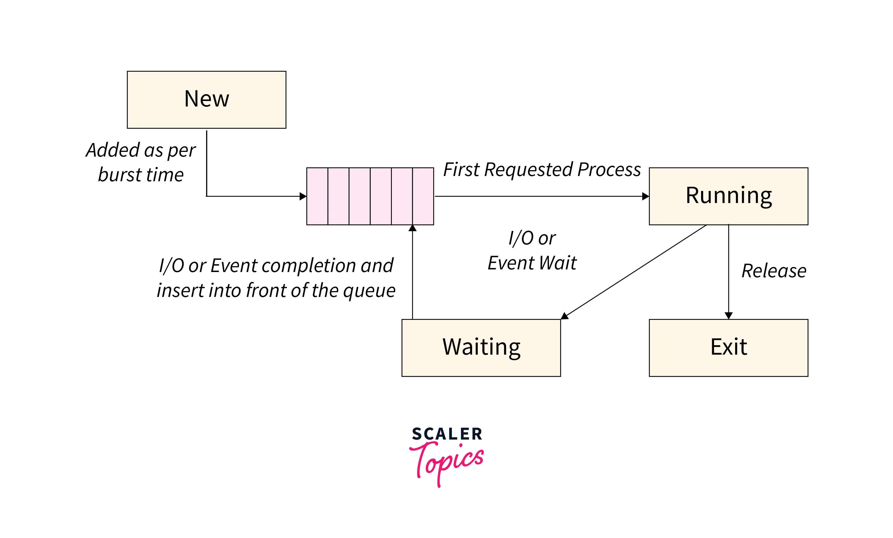
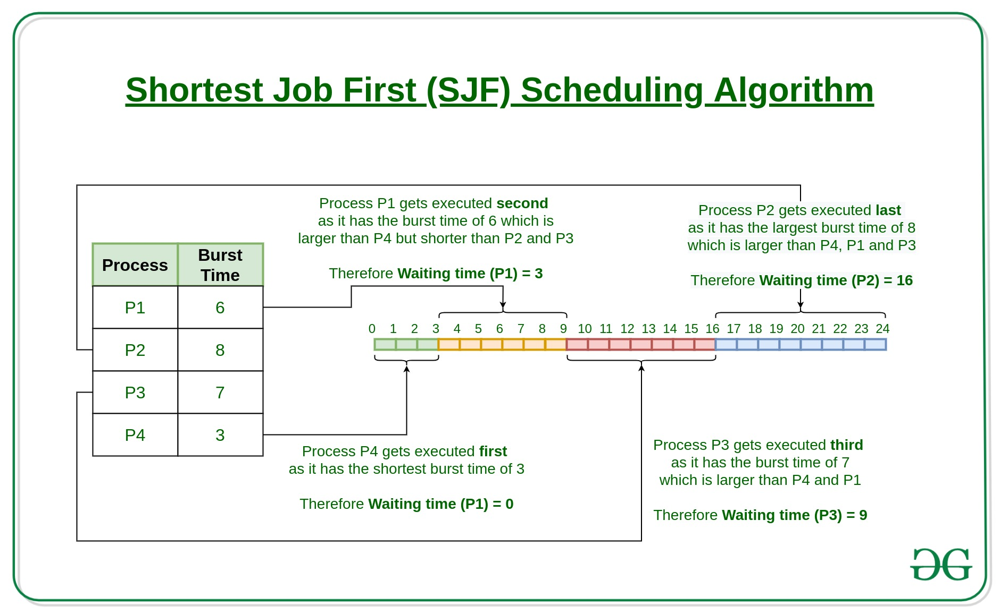

# First Come First Serve - Scheduling Algorithm

FIFO queue thus very inefficient and has highest average time amongst all other algorithms

# Shortest Job First

- Need to sort the processes based on the Proccess times
    - Heap Sort: O(nlog(n)) time complexity
    - As heap sort uses graph structures we will code this in C++ as it is easier
    - [Heap Data Structure](https://www.geeksforgeeks.org/binary-heap/)

# Longest Job First -> Max Heap instead of Short Heap

# Priority Scheduling:
- Classify SJF and add a another Process property: priorty

# Round Robin [Understand Implementation](https://www.geeksforgeeks.org/program-for-round-robin-scheduling-for-the-same-arrival-time/)

# SRTF and LRTF

# HRRN

# Multiple Queue Scheduling

# Multi-level feedback queue scheduling
